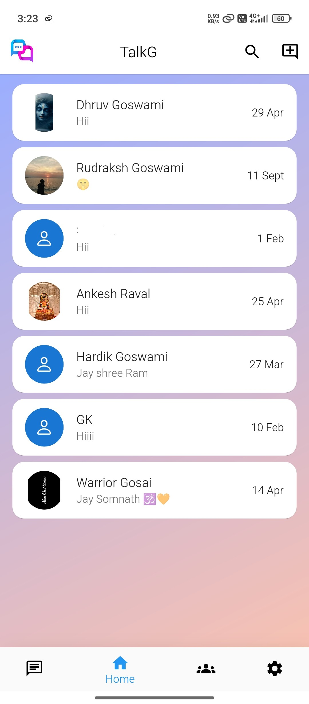
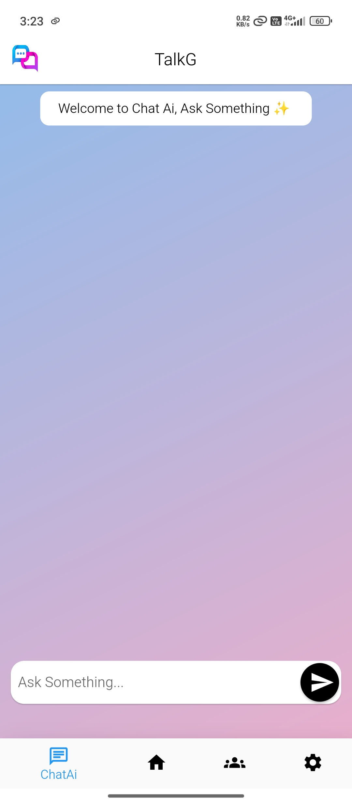
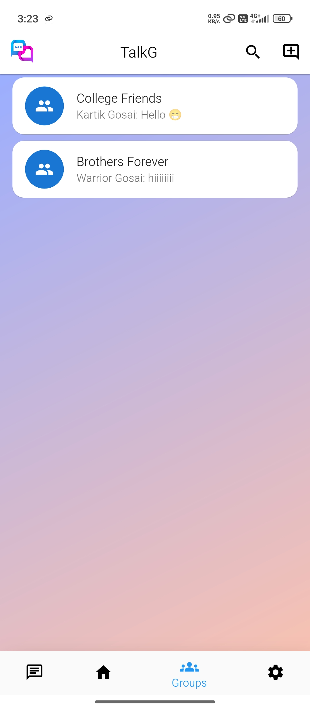
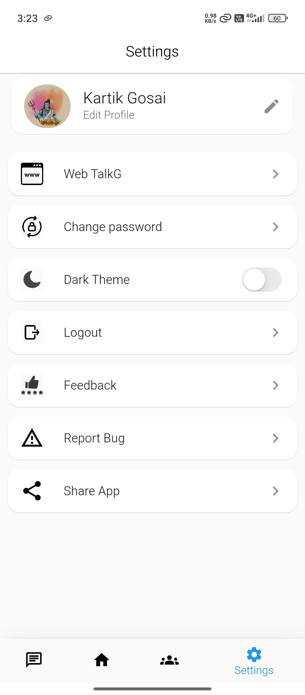
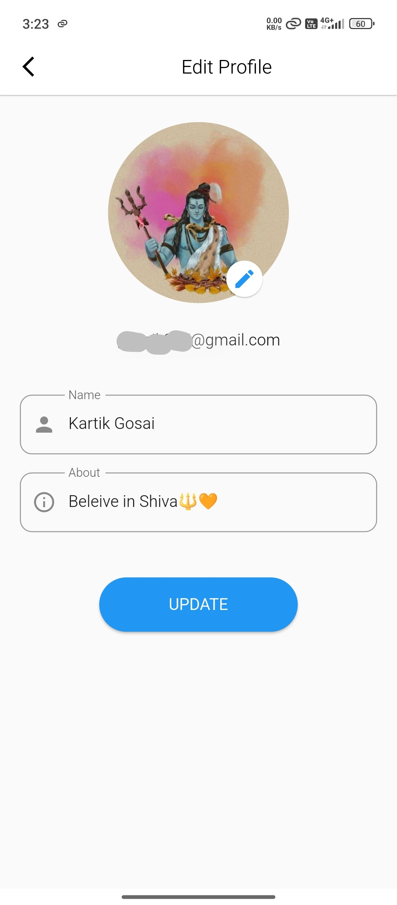
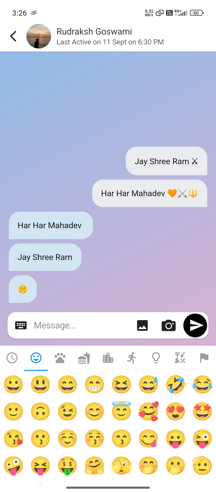
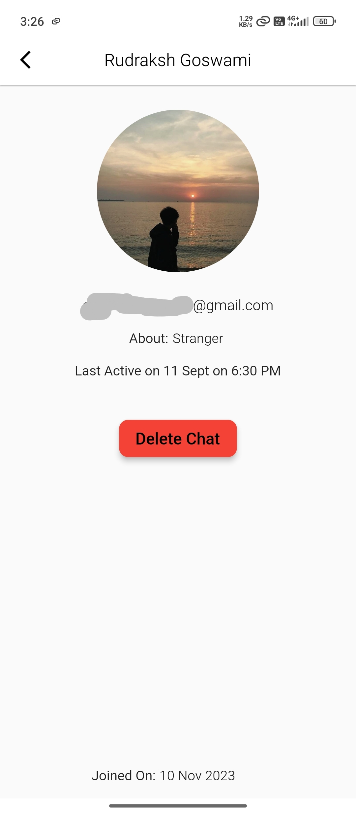

# 💬 TalkG - Chat App

TalkG is a **real-time, cross-platform chat application** built using **Flutter**.  
Designed with simplicity and speed in mind, TalkG enables users to communicate seamlessly across **Android, iOS, and Web** platforms.

---

## 🚀 Features

- ⚡ Real-Time Messaging  
- 📱 Cross-Platform Support (**Android, iOS, Web**)  
- 🔐 User Authentication (**Using Firebase Auth**)  
- 👥 One-on-One & Group Chats, **Chat with AI**  
- 🟢 Activity Status  
- 🌙 Dark & Light Themes  

---

## 🛠️ Tech Stack

- **Frontend**: Flutter (Dart)  
- **Backend**: Firebase (Firestore, Firebase Auth, etc.)  

---

## 📥 Download TalkG

📱 **Android APK** → [Download Now](https://github.com/Warrior-Gosai/Download-TalkG-App)  

🌍 **Visit Website** → [http://talkg.rf.gd](http://talkg.rf.gd)  

---

## 📸 Screenshots

  
  
  
  

  
  
  
  

---

## 🤝 Contributing

Contributions are always welcome!  
If you’d like to improve the app, feel free to fork the repo and submit a pull request.  

---

## 📜 License

This project is licensed under the MIT License.  

---

## 👤 Author

**Warrior Gosai** & **SUPREME**
- GitHub: [@Warrior-Gosai](https://github.com/Warrior-Gosai)
- GitHub: [@SHC-SUPREME](https://github.com/SHC-SUPREME)
- Website: [http://talkg.rf.gd](http://talkg.rf.gd)  

---

✨ Share with your friends and enjoy chatting with **TalkG**!
